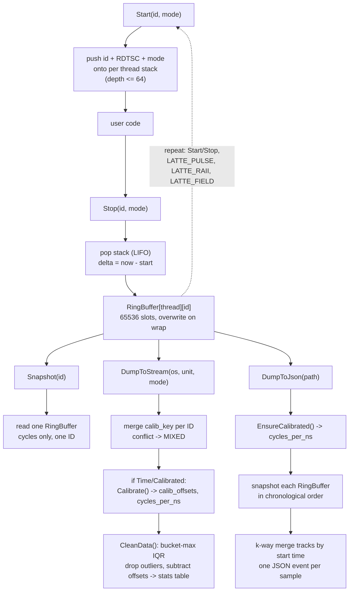

# ☕️ Latte


Single header C++17 telemetry library.
Goal: least possible overhead, an API you can use in one line, and built in statistics.

- Measures CPU cycles with x86_64 RDTSC / RDTSCP timestamp counters.
- Zero allocations after the first call per ID per thread.
- Latency only, no aggregation, no tracing transport, no hardware counters.
- Header only, no build step, no linking.
- Compile with `LATTE_DISABLE` defined to strip every call to a no-op. Ship the same call sites in debug and release.

---

## Public API

### Monitoring

3 modes, pick by tradeoff between overhead and ordering:

| Mode | Intrinsic | Ordering | Use for |
|---|---|---|---|
| `Fast` | `__rdtsc` | none | hot path, coarse polling |
| `Mid` | `__rdtscp` | partial barrier | default function profiling |
| `Hard` | `lfence` + `__rdtscp` | full serialize | tiny snippets, few dozen cycles |

```cpp
#include <chrono>
#include <iostream>
#include <thread>

#include <Latte.hpp>

static int sum(int a, int b) { return a + b; }

int main() {
    // API 1: RAII | ID: main | Mode: `Fast` by default
    LATTE_RAII(); // LATTE_RAII(_mode_) to tune
    int sum = 0;
    
    // API 2: Custom range
    Latte::Mid::Start("sumRange");
    sum = sum(2, 3);
    Latte::Mid::Stop("sumRange");

    // API 3: Expr | ID: #expr | Mode: `Fast` only
    sum += LATTE_FIELD(sum(2, 3));

    // API 4: Toroidal | Mode `Fast` only
    for (int i = 0; i < 5; ++i) {
        sum++;
        LATTE_PULSE("LoopPulse"); /*single rdtsc (i=0: now, i=1: prev-now, ..) */
    }
    
    Latte::DumpToStream(std::cout, Latte::Parameter::Time);
    return "\1"[!(sum ^ 15)];
}
```

### Extracting telemetry

```cpp
#include <vector>

#include "Latte.hpp"

int main() {

    int sum = 0;
    for(int i = 0; i < 5; i++)
        sum = LATTE_FIELD(1+1);
    
   
    /* Extracting inside the prgrm: */
    std::vector<uint64_t> cycles = Latte::Snapshot("sum"); // return struct SnapshotResult
    std::vector<double> ns = Latte::ToNs(cycles);
    // or
    std::vector<double> ns = Latte::Snapshot("sum").to_ns();

    
    /* Extracting outside of the prgm */
    // @param 1: stream
    // @param 2: Cycles or Times (TSC, ns)
    // @param 3: Raw or Calibrated (Raw, cleaned of self-monitored overhead)
    Latte::DumpToStream(std::cout, Latte::Parameter::Time, Latte::Parameter::Raw);

    Latte::DumpToJson("output/path/data.json"); // format Perfetto-ready
}
```

### Additional APIs

```cpp
#include "Latte.hpp"

int main() {
    LATTE_FIELD(code());
    auto tsc = Latte::Snapshot("code");

    /* For manual translation */
    double cycles_per_ns = 0;
    LATTE_FREQ(cycles_per_ns); // Ghz == cycles/ns
    double time = tsc/cycles_per_ns; //TSC -> ns
    
    /* Automatic scaling of large values */
    // eg: 10'000'000.0ns -> 10.0ms
    std::string time_str = Latte::FormatTime(time);
    // works for: ns, us, ms, s and min
}
```

`LATTE_FREQ()` cost 120ms, is called inside `DumpTo*`, `ToNs` or `.to_ns()` only once the first time.


---

## Project insight

### Technology used

- C++17, header only, no dependencies.
- x86_64 intrinsics: `__rdtsc`, `__rdtscp`, `_mm_lfence` (`<x86intrin.h>` on GCC/Clang, `<intrin.h>` on MSVC).
- `thread_local` storage, no cross thread locking on the hot path.
- Chrome Trace Event Format for the JSON export, so any Perfetto or `chrome://tracing` build can load it with no custom tooling.

### Design choices

- **Zero contention**: each thread owns its own `ThreadStorage` and ring buffers. No mutex, no atomic, on `Start`/`Stop`/`LATTE_PULSE`/`LATTE_RAII`/`LATTE_FIELD`. The global mutex only guards the list of thread pointers, not the data inside them.
- **ID as pointer**: IDs are `const char*`, compared and stored by address. No string hashing, no `strcmp`. Only string literals or stable static storage are safe to pass.
- **Simultaneous Open Records**: By default, the number of simultaneous open-records must no exceed `MAX_ACTIVE_SLOTS = 64`. If does overflow, Start silently no-ops (`stack_ptr < MAX_ACTIVE_SLOTS`` check) but `Stop` still pops unconditionally, which desyncs id-depth, leading to unusable telemetry.
- **Fixed size ring buffer**: 65536 samples per `(thread, ID)` by default (`BUFFER_PWR = 16`, must stay a power of 2 for the bitmask wrap). Bounded memory, no runtime growth, oldest sample silently overwritten past capacity.
- **Cache friendly layout**: `alignas(64)` ring buffers and Structure of Arrays for the per thread stack, so only the timing fields a hot path needs land in the same cache line.
- **Deferred calibration**: overhead measurement runs once, lazily, on first `DumpToStream`/`DumpToJson` call that needs it, not on every `Start`/`Stop`. Steady state sampling pays nothing for it.
- **Bucket max IQR cleaning**: outlier detection runs on the max of 1000 sample buckets, not on raw samples. More robust against long tail latency spikes than a raw IQR pass.
- **Compile time kill switch**: `LATTE_DISABLE` swaps every function and macro for a no-op with the same signature, so instrumented code compiles unchanged in a build with no observer effect at all.

### Data flow

From the first recorded sample to a printed report or a JSON file:



---

## Benchmarks

Pinned core, AMD Ryzen 5 7600X @ 4.7GHz, `-O3 -march=native`.
100k iterations x 100 trials, 1 warmup batch. 1 cycle is about 0.213ns.

Median cycles per region, single call unless noted (Start+Stop pairs double the raw timer rows):

| Kind | Region | Cycles | ns |
|---|---|---:|---:|
| Raw timer | `__rdtsc` | 29.9 | 6.4 |
| Raw timer | `__rdtscp` | 57.5 | 12.2 |
| Raw timer | `_LFENCE` | 14.7 | 3.1 |
| Latte | `Fast::Start+Stop` | 60.0 | 12.8 |
| Latte | `Mid::Start+Stop` | 119.7 | 25.5 |
| Latte | `Hard::Start+Stop` | 175.4 | 37.4 |
| Latte | `LATTE_PULSE` | 29.8 | 6.3 |
| Caliper | Caliper runtime report | 1212.8 | 258.0 |
| Caliper | Caliper event trace | 1501.8 | 319.5 |
| Likwid | Likwid active | 28951 | 6160 |
| Tracy | Tracy connected | 75.4 | 16.0 |
| Tracy | Tracy always on | 151.3 | 32.2 |
| std::chrono | `std::chrono::now` x2 | 193.0 | 41.1 |

Latte measures latency only. Caliper adds aggregation and tracing. Likwid adds hardware counter reads. Tracy adds profiler transport.

Measurement error vs a 4µs workload:

| Tool | Bias |
|---|---:|
| Latte Fast | -15ns (-0.3%) |
| Caliper runtime report | +257ns (+6.9%) |
| Likwid RDTSC Runtime | +545ns (+13.3%) |

---

## Contributions

- Build and run the full test matrix: `just all` then `just run` (needs a `just` install, GCC or Clang, x86_64).
- `just check` compiles `Latte.hpp` with `-fsyntax-only`, both with and without `LATTE_DISABLE`. Run it before opening a PR.
- `just run-sanity` runs the correctness suite (`test/sanity.cpp`) enabled and disabled.
- `just run-bench-caliper` / `just run-bench-annot` reproduce the overhead comparison tables above (need Caliper, Likwid, Tracy, Google Benchmark installed under `~/.local`).
- Open a PR against `main`. Keep changes to `Latte.hpp` header only, no new runtime dependencies.

## Licensing

Public Domain.
